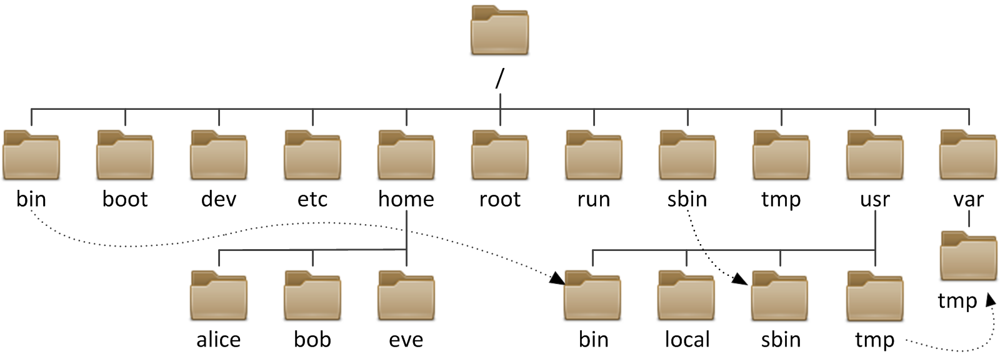

## What is Linux Filesystem hierarchy?
The Linux file system hierarchy follows a standard directory structure. The key directories include /bin, /sbin, /proc, /etc, /home, /root, /usr, /var, and /tmp. Each directory serves a specific purpose, such as storing executable binaries (/bin), configuration files (/etc), user home directories (/home - it's default base directory for non root users), and variable data like logs (/var) and temporary files (/tmp).

### Roles of each directory
#### / (Root Directory):
- The root directory is the top-level directory in the filesystem hierarchy.
- All other directories and files are subdirectories or files of the root directory.
#### /bin (Binaries):
- Essential binary executables (commands) are stored here.
- Common system commands like ls, cp, and mv are located in this directory.
#### /boot (Boot Files):
- Contains files needed for the system boot process, including the kernel and bootloader configuration.
#### /dev (Devices):
- Device files represent physical and virtual devices.
- Devices like hard drives, partitions, terminals, and printers are represented here.
#### /etc (Configuration Files):
- Contains system-wide configuration files and shell scripts used during the boot process.
- Configuration files for various services are stored in subdirectories
#### /home (Home Directories):
- Home directories for non root users accounts are created here.
- Each user has a subdirectory under /home with their username.
#### /lib (Libraries):
- Essential shared libraries needed for the binaries in /bin and /sbin are stored here.
#### /media (Removable Media):
- Mount points for removable media devices (e.g., USB drives, CD-ROMs) are created here.
#### /mnt (Temporary Mount Points):
- Provides a location for temporarily mounting filesystems.
#### /opt (Optional Software):
- Typically used for the installation of third-party software packages.
#### /proc (Process Information):
- Virtual filesystem that provides information about processes and system resources.
#### /root (Root User's Home):
- Home directory for the root user.
#### /run (Runtime Data):
- Holds system runtime data (e.g., process IDs) that should be available to processes when the system is booted.
#### /sbin (System Binaries):
- Contains essential system binaries that are typically used by the root user.
#### /srv (Service Data):
- Contains data for services provided by the system.
#### /sys (Sysfs):
- A virtual filesystem exposing information about the kernel, devices, and other kernel-related information.
#### /tmp (Temporary Files):
- A directory for temporary files created by applications and users.
#### /usr (User Binaries and Data):
- Contains user binaries, libraries, documentation, and source code.
- It is often mounted on a separate partition to facilitate system upgrades.
#### /var (Variable Data):
- Contains variable data files like logs, databases, mail, and temporary files.
- Data that may change in size and content is stored here.

**Notes:-**

This hierarchy provides a structured and organized way to manage the filesystem, making it easier for users, administrators, and developers to understand and navigate the Linux filesystem.
