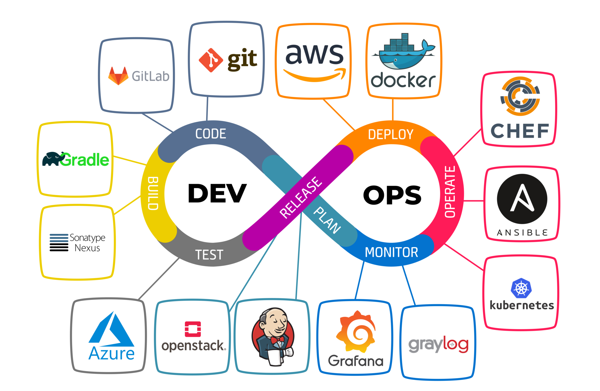

## DevOps
DevOps is a set of practices, principles, and cultural philosophies aimed at improving collaboration and communication between development (Dev) and operations (Ops) teams in software development. The primary goal of DevOps is to streamline the software delivery process, making it more efficient, reliable, and capable of quickly adapting to changes.

**Collaboration:**

DevOps emphasizes strong collaboration between development and operations teams. This means breaking down silos and fostering a culture of shared responsibility for the entire software development lifecycle.

**Automation:**

Automation is a core tenet of DevOps. It involves using tools and scripts to automate manual and repetitive tasks in the development and deployment process. This includes tasks like code integration, testing, deployment, and infrastructure provisioning.

**Version Control:**

DevOps relies heavily on version control systems like Git to manage code repositories. This ensures that code changes are tracked, and teams can collaborate effectively.

**Continuous Integration (CI):**

CI is a practice where developers frequently merge their code changes into a central repository(Git). This allows for automated testing to be performed on the integrated code, ensuring that it doesn't introduce any errors or conflicts.

**Continuous Delivery (CD):**

CD extends CI by automatically deploying code changes to production or staging environments after passing automated tests. This ensures that code is always in a deployable state.

**Infrastructure as Code (IaC):**

IaC involves managing and provisioning infrastructure using code and automation tools. This enables consistent and repeatable deployment of servers, networks, and other infrastructure components.

**Configuration Management:**

This involves managing and maintaining the configuration of servers and infrastructure components. Tools like Puppet, Chef, and Ansible are commonly used to automate configuration tasks.

**Security and Compliance:**

Security practices are integrated into the DevOps process, with an emphasis on incorporating security measures early in the development lifecycle. Compliance with regulatory standards is also a key consideration.

**Monitoring and Feedback:**

DevOps emphasizes continuous monitoring of applications and infrastructure to gain insights into their performance and health. This feedback loop helps teams identify and address issues quickly.

**Continuous Improvement:**

- DevOps is a continuous journey of improvement. Teams regularly reflect on their processes, identify areas for enhancement, and implement changes to optimize the development and deployment pipeline.
- Overall, DevOps aims to create a more agile, efficient, and reliable software development process. By breaking down barriers between development and operations teams, and by leveraging automation and best practices, organizations can deliver higher-quality software at a faster pace.
